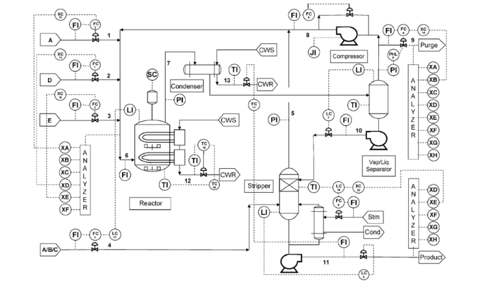

# PROJECT
## INFO
This repo contains our implementations of the CHE 4230 Advanced Process Control Systems – Spring 2023 Semester Project. The project has a plant setup as shown below:

##  GROUP MEMBERS 
>**1. Ana B Terreros**\
>**2. Amanda M Ross**\
>**3. Teslim O. Olayiwola**
## CONTENT
>**data** contains the data used in this study.\
>**notebooks** contains the all the jupyternook.\
>**models** contains the trained and serialized models, model predictions and summaries\
>**src** contains the python modules. \
>**docs** contains the other non-related PDF docs. \
>**reports** contains the analysis (PDF) and figures.
## HOW TO USE

>**incoming** 
